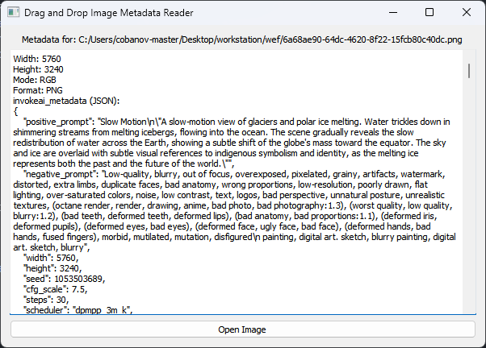

# Image Metadata Reader

A simple drag-and-drop GUI application to read and display image metadata, including EXIF data and PNG header information. This application is built using Python, PyQt5, and Pillow.

## Features

- **Drag and Drop Interface**: Easily drag and drop image files onto the application window.
- **Supports Multiple Image Formats**: Works with JPEG, PNG, TIFF, BMP, and GIF images.
- **EXIF Data Extraction**: Extracts and displays EXIF metadata from images that contain it.
- **PNG Metadata Parsing**: Reads and displays PNG header information and textual metadata.
- **JSON Parsing**: Detects JSON-formatted metadata and presents it in both raw and human-readable formats.
- **User-Friendly GUI**: Simple and intuitive interface.

## Requirements

- Python 3.x
- PyQt5
- Pillow

## License

This project is licensed under the MIT License - see the [LICENSE](LICENSE) file for details.

## Contact

For questions or suggestions, please contact [mertcobanov@gmail.com](mailto:mertcobanov@gmail.com)
